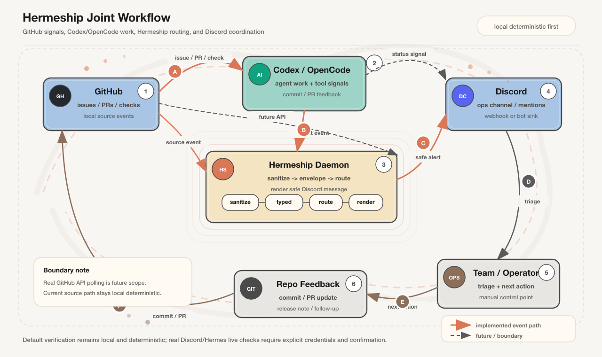

<p align="center">
  
</p>

<p align="center">
  <strong>Hermes-native daemon-first event notification router</strong>
</p>

<p align="center">
  <a href="./README.md"><kbd>中文</kbd></a>
  <strong><kbd>English</kbd></strong>
</p>

Hermeship is an independent, Hermes-native, daemon-first event notification router. It owns its Hermes event contracts, Rust daemon, routing, rendering, delivery runtime, and release verification flow.

## Contents

- [What Hermeship Is](#what-hermeship-is) · [30-Second Local Smoke](#30-second-local-smoke) · [Capability Matrix](#capability-matrix) · [Workflow Surface](#workflow-surface) · [Design Principles](#design-principles)
- [Diagrams](#diagrams) · [Architecture](#architecture) · [Install And Configure](#install-and-configure) · [Hermes Integration](#hermes-integration) · [Sending Events](#sending-events)
- [Routing, Rendering, And Privacy](#routing-rendering-and-privacy) · [Known Limitations](#known-limitations) · [Rollback](#rollback) · [Live Verification](#live-verification) · [Release Preflight And Development Gates](#release-preflight-and-development-gates)
- [Troubleshooting](#troubleshooting)

## What Hermeship Is

Hermeship receives events from Hermes gateway hooks, an optional Hermes observer plugin, CLI commands, and local deterministic source commands. It normalizes those events into typed envelopes, sanitizes payloads, routes deliveries, renders safe summaries, and sends them through sinks such as Discord.

Operational boundaries:

- It does not modify Hermes core.
- It does not write notification messages back into Hermes conversations.
- It does not auto-enable the observer plugin.
- Default tests and source commands use local deterministic paths; real Discord/Hermes verification is tracked separately.

## 30-Second Local Smoke

The first `cargo run` will compile the project. This path does not require Discord credentials.

```bash
# Terminal 1
cargo run -- start

# Terminal 2
cargo run -- status
cargo run -- explain hermes.agent.started --payload '{"session_id":"demo","platform":"telegram","project":"Hermeship"}'
cargo run -- emit hermes.agent.started --payload '{"session_id":"demo","platform":"telegram","project":"Hermeship"}'
cargo run -- release preflight 0.1.0
```

## Capability Matrix

### Implemented

| Capability | Default | Verification / boundary |
| --- | --- | --- |
| Rust daemon + HTTP ingress | Yes | `GET /health`, `POST /event`, `POST /api/hermes/hook` |
| Gateway hook bridge | Explicit install | fail-open; bridge failures do not block Hermes |
| Discord sink | Requires config | bot token/channel and webhook are supported |
| Observer plugin | Explicit install | manual enablement required; Python smoke + preflight covered |
| Deterministic source commands | Yes | local Git / GitHub / tmux / cron / memory paths |
| Release preflight | Yes | checks docs, templates, and record fields; does not assert real live pass |

### Disabled By Default Or Not Implemented

| Capability | Status | Boundary |
| --- | --- | --- |
| Slack sink | Out of default scope | Not implemented by default |
| Real GitHub API polling | Not implemented | Future scope |
| Real tmux watch / scheduler / service-manager install | Not implemented | Stays local deterministic |
| Real Discord/Hermes live verification pass | Not obtained | Results live in `docs/live-verification.md` |

## Workflow Surface

| Surface | Command | Purpose | Boundary |
| --- | --- | --- | --- |
| Daemon health | `hermeship status` / `GET /health` | Check daemon, queue, and sink health | No real external system required |
| Event ingress | `hermeship send` / `emit` / `hermes hook` | Enter the typed event flow | `explain` explains only; it does not enqueue |
| Hermes bridge | `hermeship hermes install-hooks` / `uninstall-hooks` | Manage hook bridge lifecycle | fail-open; does not modify Hermes core |
| Observer plugin | `hermeship hermes install-plugin` / `enable-plugin` | Install template and print manual enablement guidance | Explicit operator enablement required |
| Local source | `hermeship git/github/tmux/cron/memory ...` | Generate deterministic events | No real GitHub/tmux/scheduler access |
| Release preflight | `hermeship release preflight 0.1.0` | Run release checks | Record fields only; not a real live pass proof |

## Design Principles

Hermeship is a coordination control plane, not a prompt-side status formatter.

- Notification logic stays outside the agent context; the daemon owns sanitization, queueing, routing, rendering, and delivery.
- People set direction and make engineering judgments; the system runs the feedback loop and reports results.
- Every hop should be typed, explainable, failure-aware, and deterministic-first by default.

## Diagrams

### Architecture Overview


Hermeship runtime pipeline from ingress to Discord.

### Event And Routing Lifecycle


Events enter typed envelopes, then pass through routing, rendering, and delivery.

### Observer Boundary


The observer path sends safe summaries without expanding Hermes context.

### Joint Workflow



The joint workflow diagram shows the loop between GitHub issue/PR/check signals, Codex/OpenCode agent work, Hermeship sanitization/routing, and Discord coordination. GitHub API polling remains future scope; the current source path stays local deterministic.

Diagram sources live in `docs/assets/diagrams/*.json`; each diagram is exported as `.svg` and `.png` with `fireworks-tech-graph` Style 6, Claude Official.

## Architecture

The runtime pipeline is:

```text
Hermes gateway hooks / optional observer plugin / CLI / local source commands
  -> daemon ingress
  -> privacy sanitizer
  -> typed EventEnvelope
  -> bounded queue
  -> Dispatcher
  -> Router
  -> Renderer
  -> Sink
  -> Discord
```

See `ARCHITECTURE.md` for module boundaries.

## Install And Configure

```bash
cargo install --path .
hermeship install
```

Configure Discord without putting the token in shell history:

```bash
printf '%s' "$DISCORD_TOKEN" | hermeship setup \
  --discord-token-stdin \
  --default-channel <discord-channel-id> \
  --daemon-url http://127.0.0.1:25295
```

You can also read the token from an environment variable:

```bash
hermeship setup --discord-token-env HERMESHIP_SETUP_DISCORD_TOKEN
```

Inspect configuration:

```bash
hermeship config path
hermeship config show
hermeship config verify
```

Start and check the daemon:

```bash
hermeship start
hermeship status
```

Default daemon endpoint:

```text
http://127.0.0.1:25295
```

Public HTTP API:

| Method | Path | Responsibility |
| --- | --- | --- |
| `GET` | `/health` | Return daemon, queue, and configured sink health |
| `POST` | `/event` | Accept generic `IncomingEvent` JSON |
| `POST` | `/api/hermes/hook` | Accept Hermes gateway hook envelopes |

## Hermes Integration

Install the gateway hook bridge:

```bash
hermeship hermes install-hooks --scope global --force
```

Uninstall it safely:

```bash
hermeship hermes uninstall-hooks --home ~/.hermes
```

Install the optional observer plugin template:

```bash
hermeship hermes install-plugin --home ~/.hermes --force
hermeship hermes enable-plugin --home ~/.hermes --dry-run
```

Then enable it manually from Hermes:

```bash
hermes plugins enable hermeship-observer
```

The hook bridge and observer plugin are fail-open. Hermeship failures should not stop Hermes gateway or agent execution.

## Sending Events

```bash
hermeship send --channel <discord-channel-id> --message "hermeship smoke"
hermeship emit hermes.agent.started --payload '{"session_id":"demo","platform":"telegram","project":"Hermeship"}'
hermeship explain hermes.agent.started --payload '{"session_id":"demo","platform":"telegram"}'
```

Simulate a Hermes hook payload:

```bash
printf '%s' '{"event":"agent:start","context":{"session_id":"demo","agent_name":"codex"}}' \
  | hermeship hermes hook --payload -
```

Local deterministic source commands include:

```bash
hermeship git commit --repo hermeship --branch main --commit 1234567890abcdef1234567890abcdef12345678 --summary "ship git source"
hermeship git branch-changed --repo hermeship --old-branch main --new-branch codex/milestone-8-git
hermeship github issue-opened --owner posp --repo hermeship --number 42 --title "Add deterministic GitHub source"
hermeship github pr-opened --owner posp --repo hermeship --number 17 --title "Ship GitHub source" --branch codex/milestone-8-github
hermeship github check-failed --owner posp --repo hermeship --workflow ci --status failure --branch main
hermeship github release-published --owner posp --repo hermeship --tag v0.1.0
hermeship tmux keyword --session hermes-agent --keyword FAILED --line "build FAILED at deterministic fixture"
hermeship tmux stale --session hermes-agent --pane %2 --minutes 15 --last-line "waiting for agent output"
hermeship tmux watch --session hermes-agent --keywords FAILED,complete --stale-minutes 10 --tmux-output $'hermes-agent\tmain\t%1\t0\tbash\tready'
hermeship tmux list --tmux-output $'hermes-agent\tmain\t%1\t0\tbash\tready'
hermeship cron run dev-followup
hermeship memory init --root /tmp/hermeship-memory --project Hermeship --channel ops --agent codex --date 2026-06-17
hermeship memory status --root /tmp/hermeship-memory --project Hermeship --channel ops --agent codex --date 2026-06-17
```

These source commands do not currently poll real GitHub, read real tmux sessions, or run a real scheduler.

## Routing, Rendering, And Privacy

Router behavior:

- event glob matching supports exact kinds and `*` patterns.
- one event can resolve to 0..N deliveries.
- route filters use structured metadata and selected typed body fields, not rendered text.
- unsupported sinks, missing targets, and disabled routes produce diagnostics.

Supported formats:

- `compact`
- `inline`
- `alert`
- `raw`

Hermeship routes summaries and structured metadata, not full conversations. Tokens, cookies, secrets, full prompts, full conversations, provider request/response bodies, and tool result bodies must not appear in fixtures, logs, live records, or docs.

`raw` rendering is still safe JSON: it emits typed controlled fields and sanitized payload summaries, not arbitrary original payload.

## Known Limitations

- Real Discord/Hermes live verification has not passed yet.
- Real GitHub API polling, real tmux watching, real scheduling, and automatic service-manager installation are not implemented.
- Slack sink is not part of the default scope.
- The observer plugin still requires explicit installation and manual enablement.

## Rollback

Rollback only the Hermes hook:

```bash
hermeship hermes uninstall-hooks --home ~/.hermes
```

Uninstall while preserving local config and state:

```bash
hermeship uninstall
```

Explicitly remove local state, logs, config, and Hermeship-managed hooks:

```bash
hermeship uninstall --remove-state --remove-config --remove-hooks --hermes-home ~/.hermes
```

## Live Verification

Live verification is separate from default local tests. Real Discord/Hermes checks require Discord credentials, a test channel, a Hermes gateway test environment, explicit execution confirmation, and a rollback window.

Real Discord/Hermes live verification has not passed yet. Existing `blocked` / `not_run` records live in `docs/live-verification.md`.

## Release Preflight And Development Gates

```bash
hermeship release preflight 0.1.0
```

Run local gates before a stage commit:

```bash
python3 -m py_compile templates/hermes-plugin/__init__.py
cargo test observer_plugin
cargo test release_preflight
cargo run -- release preflight 0.1.0
cargo fmt --all -- --check
cargo clippy --all-targets -- -D warnings
cargo test
```

Default tests must stay local and deterministic. Do not run the real Discord/Hermes live check unless credentials, a test channel, a Hermes gateway test environment, and explicit execution confirmation are available.

## Troubleshooting

- `status` fails: confirm the daemon is running in another terminal, then check `HERMESHIP_DAEMON_URL`.
- `emit` or `send` does not deliver: verify routes, channel, Discord token, and sink configuration.
- Observer plugin is silent: run `python3 -m py_compile templates/hermes-plugin/__init__.py`, then confirm the template is installed and manually enabled.
- `release preflight` shows live verification ok: that only means record fields exist; it is not proof of a real live pass.
